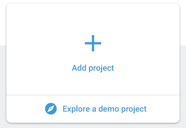
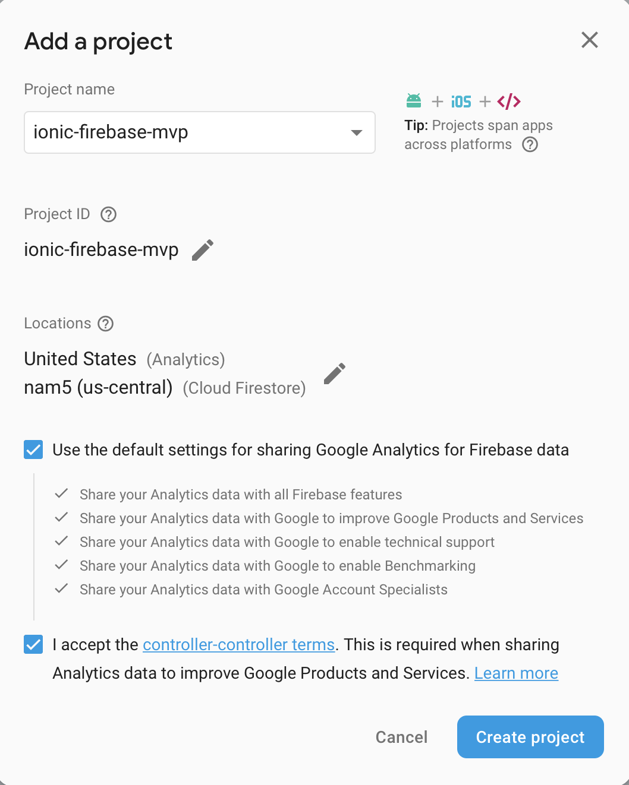
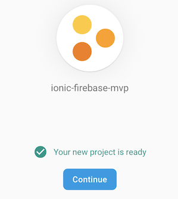
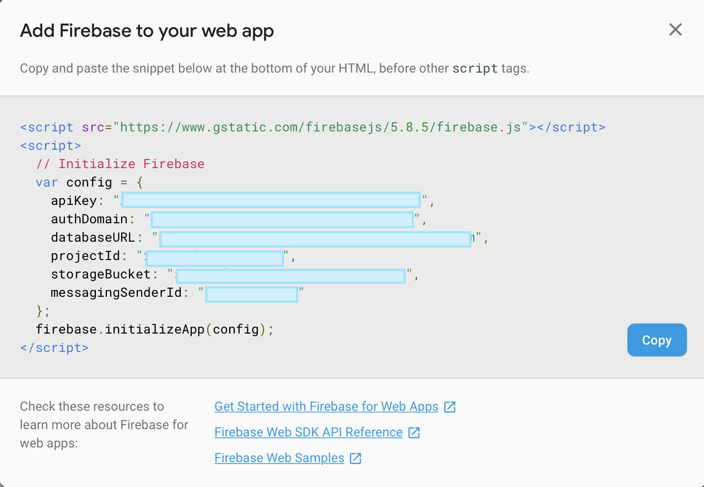

# Firebase Setup

This section describes how to set up a Firebase project.

## Create a Firebase project
* Navigate to [Firebase](https://console.firebase.google.com)
* Once you sign in (with your Google credentials), you should see:

* Click on Add a new project -

* Give your project a name -

* Accept the Terms & Conditions, then Click **Create Project**

* After a while, you should see:

> Milestone: New Firebase Project Created!

* Firestore has a load of functions.  Don't be intimidated.  We're only going to use a subset of features/functions for now.  Think of Word/Excel - 90% of users only use basic functionality.

* Get your project credentials by clicking the following -

* Make a note of the following - we're going to need it later -

> Milestone: You have your credentials for your Firebase project

### [Next Step: Firestore Setup](firestore_setup.md)