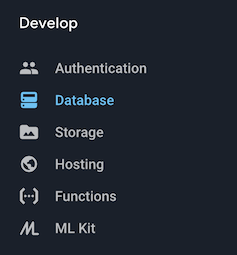
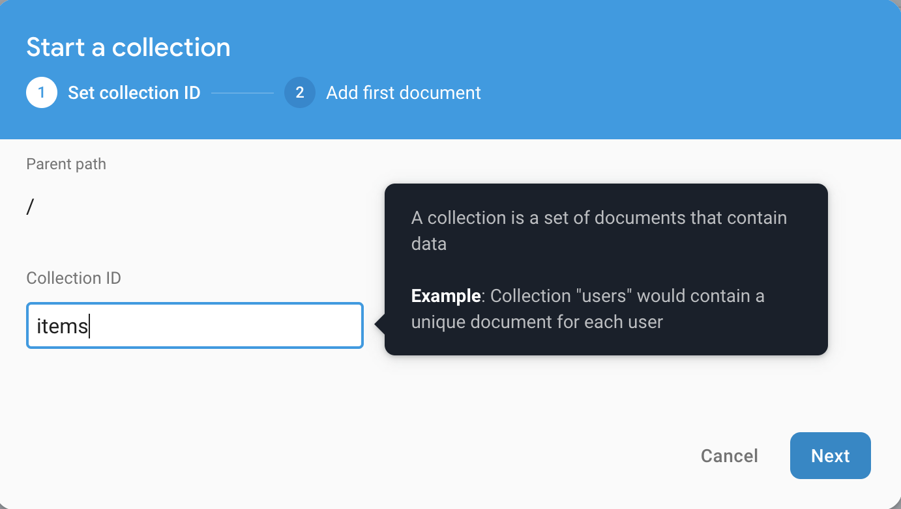
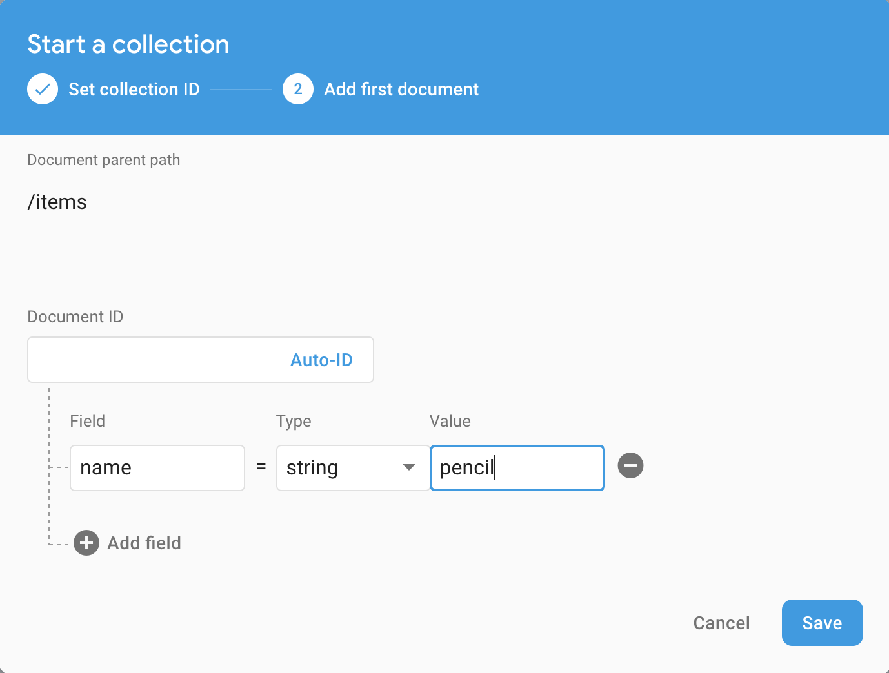
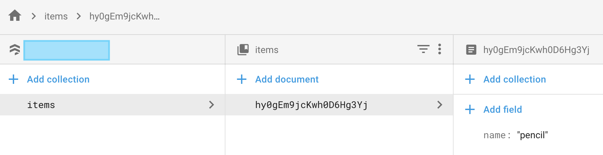

# Firestore Setup

This section describes how to set up a Firestore database.

* From the Develop Menu, select Database

* Create a new Cloud Firestore database

* As we are still in "Development", select *Start in test mode* for the Security rules

1.  Click *Add Collection*

2.  For the *Collection ID*, enter **items** and click *Next*

3. Add a document by entering **name** in *Field* and **pencil** in *Value*

4.  Your Firestore page should now look like this -

