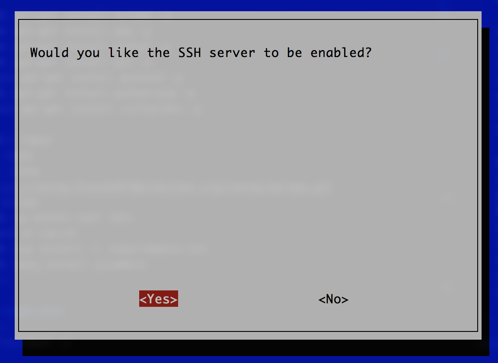

# HOWTO: Configure a GPS Module with Raspberry Pi

## Hardware Setup

### GPS Module

[UART GPS NEO-7M-C from Micro Robotics](https://www.robotics.org.za/W8748)

### Raspberry Pi

I am using a [Raspberry Pi Model B Rev 2](https://www.pishop.co.za/store/raspberry-pi-boards/raspberry-pi--model-b)

| NEO   | Raspberry Pi  | Which Is  |
| ----- |:-------------:|:------------|
| VCC   | Pin 1         | 3.3v        |
| TX    | Pin 10        | RX (GPIO15) |
| RX    | Pin 8         | TX (GPIO14) |
| GND   | Pin 6         | Ground      |

## Software Setup

### Raspberry Pi 

- Install Raspbian Lite.
- Flash an SD Card with Etcher

Boot pi and log in with:
- username: *pi*
- password: *raspberry*

As you will enable SSH, it might be a good idea to change the default password.  Its pretty quick from the commandline:

Run the following:
~~~~
sudo raspi-config
~~~~

Select Finish and Reboot the Pi

### Install GPS Packges

Run the following:

~~~~
sudo apt-get update -y
sudo apt-get upgrade -y
sudo apt-get install gpsd gpsd-clients python-gps -y
~~~~

Update 10-2024
~~~~
sudo apt-get install gpsd gpsd-clients -y
~~~~

### Verify Comms between Pi and GPS Module

~~~~
cat /dev/ttyAMA0
~~~~

~~~~
gpsmon /dev/ttyAMA0
~~~~

~~~~
sudo systemctl stop gpsd.socket
sudo systemctl disable gpsd.socket
sudo gpsd /dev/ttyAMA0 -F /var/run/gpsd.sock
~~~~

~~~~
sudo cgps -s
~~~~

- Reboot Pi

## Lets do this from Python!

~~~~
sudo apt-get install python-pip -y
pip install gps3
pip install python-dateutil
pip install pytz
~~~~

~~~~
sudo systemctl stop gpsd.socket
sudo systemctl disable gpsd.socket
sudo gpsd /dev/ttyAMA0 -F /var/run/gpsd.sock
~~~~

~~~~
python test.py

Hello world..
2018-05-01 20:46:47+00:00 - {'latitude': -26.032617679, 'altitude': 1482.076, 'speed': 0.005, 'longitude': 28.092394719, 'time': u'2018-05-01T20:46:47.000Z'}
2018-05-01 20:46:57+00:00 - {'latitude': -26.032617579, 'altitude': 1482.121, 'speed': 0.161, 'longitude': 28.092396851, 'time': u'2018-05-01T20:46:57.000Z'}
2018-05-01 20:47:07+00:00 - {'latitude': -26.032615897, 'altitude': 1481.979, 'speed': 0.072, 'longitude': 28.092401288, 'time': u'2018-05-01T20:47:07.000Z'}
~~~~

## Publish message to Google Cloud Pub/Sub

Uncomment the following lines in *test.py*

~~~~
from google.cloud import pubsub_v1

publisher = pubsub_v1.PublisherClient()
topic_path = publisher.topic_path('newfriendlychat-63187','my-valuation-topic')

publisher.publish(topic_path, data=json_string)
~~~~
