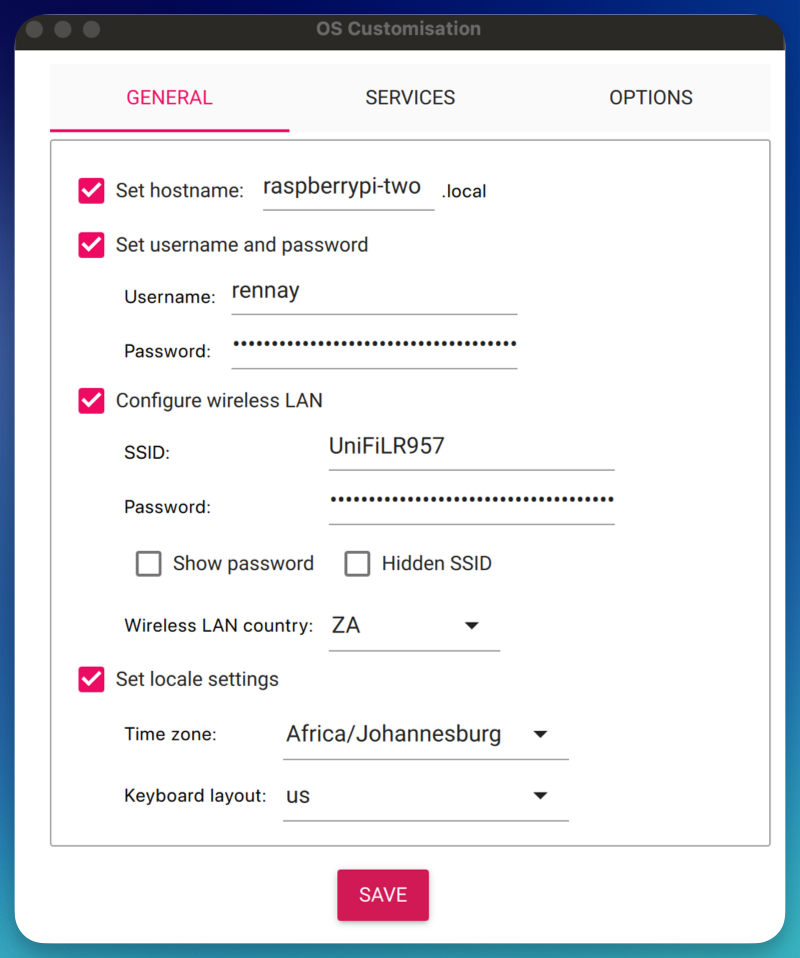
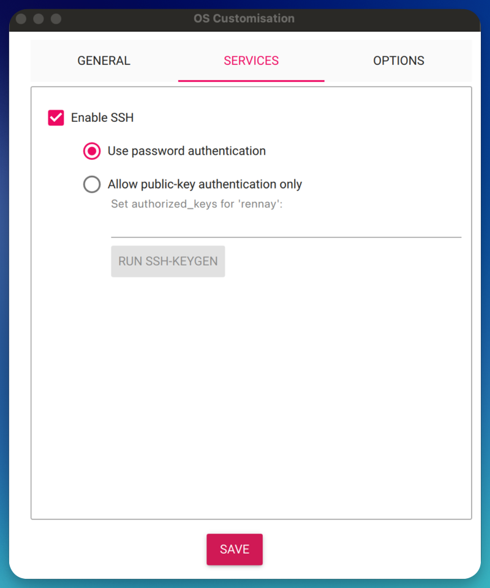
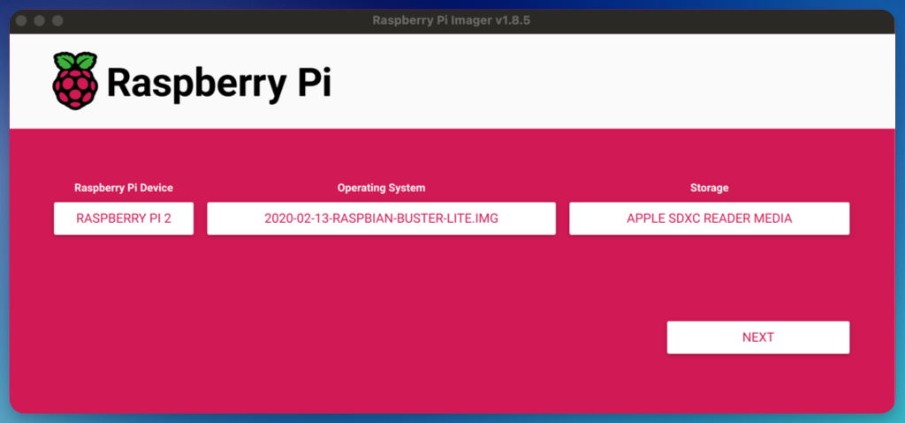
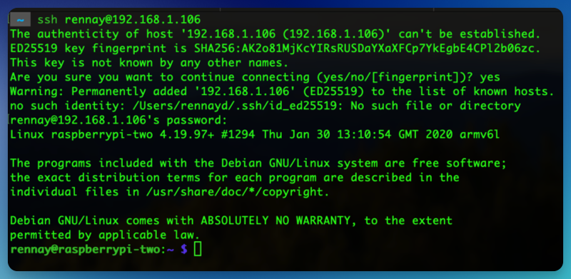

## Steps to commission a Raspberry Pi

* Download Raspbian Buster Lite - https://downloads.raspberrypi.org/raspbian_lite/images/raspbian_lite-2020-02-14/
* Unzip

* User Raspberry Pi Imager to write the image to a memory card.  I used a 16GB card.

* Set up username and WiFi so you can connect remotely

* Enable SSH

* Start the imaging

* Insert the memory card into the Pi and boot
* On the first boot, allow it time to run through the initial startup. Wait 5-10 minutes, even if you see a login prompt.

* `ssh rennay@192.168.1.106`

* `sudo apt-get update`

* As this is an older version of Raspbian, we will get an error when we try to update

")

* `sudo apt-get update --allow-releaseinfo-change`

")

* Now run `sudo apt-get update`

")

* `sudo raspi-config`
  * Interfacing Options
    * P1 Camera
      * Would you like the camera interface to be enabled?
        * Yes
  * Finish
    * Reboot

* Test the camera
  * `raspistill -o test.jpg`
    * Confirm test.jpg has been created