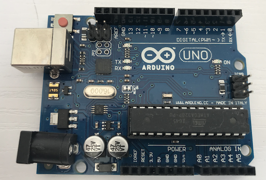
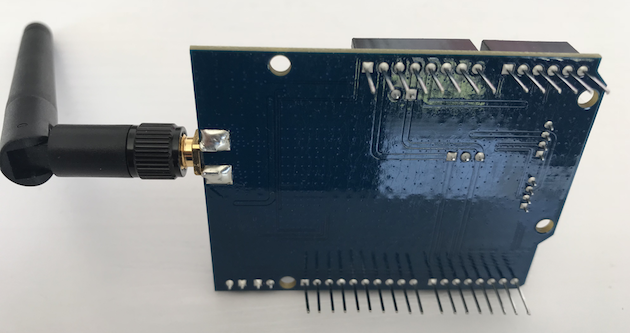
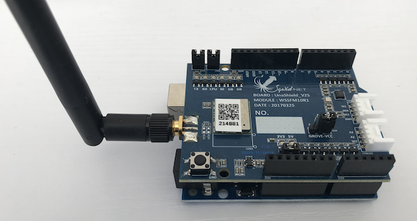
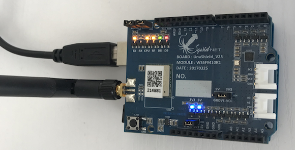
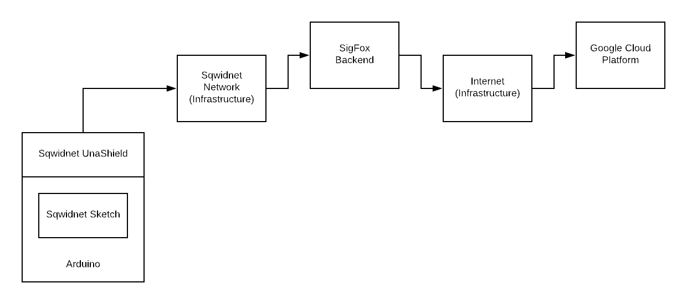
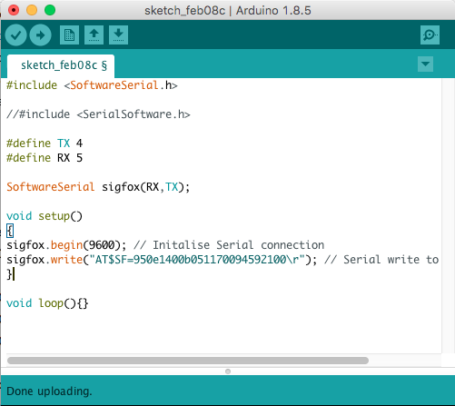
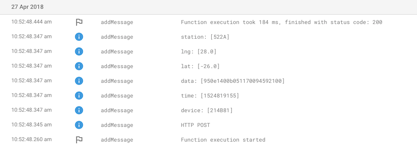

# HOWTO: Send a SigFox message using Sqwidnet UnaShield and Arduino UNO

## 1. Hardware Setup

* Arduino Uno



*  Sqwidnet UnaShield




*  Arduino + UnaShield

Line up the pins of the UnaShield and Arduino UNO and plug them together.  Note that its a perfect alignment.  Take your time - try not to bend any pins.



*  Arduino + UnaShield + USB

You will need a USB Type A - Type B cable.  Type A goes into your computer USB port.  Type B into the UNO.



## 2. SigFox/Sqwidnet Setup

*  Device Registration

    Follow the instructions at [Sigfox Device Registratio] (https://unabiz.github.io/unashield) to register your device.

* Log into [Sigfox Backend](https://backend.sigfox.com)

* Verify that the device has been successfully registered - [Check Device](https://backend.sigfox.com/device/list).  It should appear in the Device list.


## 3. Arduino Setup

### 3.1. Environment Preparation

* Install IDE - [Arduino IDE](https://www.arduino.cc/en/Main/Software)

* Take your time and get comfortable with how the IDE works.  Spend a few minutes of the "Blink an LED" tutorial.

* Compile/Verify the following code from [Blink Tutorial](https://www.arduino.cc/en/tutorial/blink)

~~~~
/*
  Blink

  Turns an LED on for one second, then off for one second, repeatedly.

  Most Arduinos have an on-board LED you can control. On the UNO, MEGA and ZERO
  it is attached to digital pin 13, on MKR1000 on pin 6. LED_BUILTIN is set to
  the correct LED pin independent of which board is used.
  If you want to know what pin the on-board LED is connected to on your Arduino
  model, check the Technical Specs of your board at:
  https://www.arduino.cc/en/Main/Products

  modified 8 May 2014
  by Scott Fitzgerald
  modified 2 Sep 2016
  by Arturo Guadalupi
  modified 8 Sep 2016
  by Colby Newman

  This example code is in the public domain.

  http://www.arduino.cc/en/Tutorial/Blink
*/

// the setup function runs once when you press reset or power the board
void setup() {
  // initialize digital pin LED_BUILTIN as an output.
  pinMode(LED_BUILTIN, OUTPUT);
}

// the loop function runs over and over again forever
void loop() {
  digitalWrite(LED_BUILTIN, HIGH);   // turn the LED on (HIGH is the voltage level)
  delay(1000);                       // wait for a second
  digitalWrite(LED_BUILTIN, LOW);    // turn the LED off by making the voltage LOW
  delay(1000);                       // wait for a second
}
~~~~

* Upload

* Check device - you should see a flashing LED

### 3.2. Turn on LED

* Make the following code change:

~~~~
void loop() {
  digitalWrite(LED_BUILTIN, HIGH);   // turn the LED on (HIGH is the voltage level)
  delay(1000);                       // wait for a second
//  digitalWrite(LED_BUILTIN, LOW);    // turn the LED off by making the voltage LOW
//  delay(1000);                       // wait for a second
}
~~~~

* Upload

* Check device - LED should be on

### 3.3. Turn off LED

* Make the following code change:

~~~~
void loop() {
//  digitalWrite(LED_BUILTIN, HIGH);   // turn the LED on (HIGH is the voltage level)
//  delay(1000);                       // wait for a second
  digitalWrite(LED_BUILTIN, LOW);    // turn the LED off by making the voltage LOW
  delay(1000);                       // wait for a second
}
~~~~

* Upload

* Check device - LED should be off

## 4. Send message to SigFox/Sqwidnet

* Compile/Verify the following code in the Arduino IDE:

~~~~
#include <SoftwareSerial.h>

#define TX 4
#define RX 5

SoftwareSerial sigfox(RX,TX);

void setup()
{
sigfox.begin(9600); // Initalise Serial connection
sigfox.write("AT$SF=950e1400b051170094592100\r"); // Serial write to Sigfox Module
}

void loop(){}
~~~~

* Upload

* Lights should flash on UnaShield board indicating that the message is being transmitted.

* Verify the message has been received in [Sigfox Backend Messages](https://backend.sigfox.com/device/{deviceID}/messages).  


  * Note that the timestamp in the portal appears to be GMT.

  * Verify the data in your Arduino IDE is the same as the one in the Sigfox Backend

## 5. Configure a Callback

* Expose an HTTP GET service or an HTTP POST service (using Google Cloud Functions)

* Navigate to [CallBacks in Sigfox Backend Portal](https://backend.sigfox.com/devicetype/5965425b9e93a178a1b19843/callbacks)

* For HTTP GET

  * Update URL pattern as follows

    ```https://YOUR_SERVER_ADDRESS/addMessage?device={device}&time={time}&data={data}&lat={lat}&lng={lng}&station={station}```

* For HTTP POST

  * Update URL pattern as follows

      ```https://YOUR_SERVER_ADDRESS/addMessage```


  * Update Content type

      ```application/json```

  * Update Body

    ```json
    {
        "device" : "{device}",
        "data" : "{data}",
        "station" : "{station}",
        "lat" : "{lat}",       
        "lng" : "{lng}",       
        "time" : {time}
    }
    ```

## 6. Putting it all together

This is what we will now attempt to achieve:



### 1.  Send from Arudino IDE

* Change data in Arudino IDE and upload/run Sketch



### 2. Verify Message received in Sigfox Backend

* Verify message has been received in backend.sigfox.com


* Verify Callback Executed OK

### 3. Verify Message received in Google Cloud

* Verify message received

