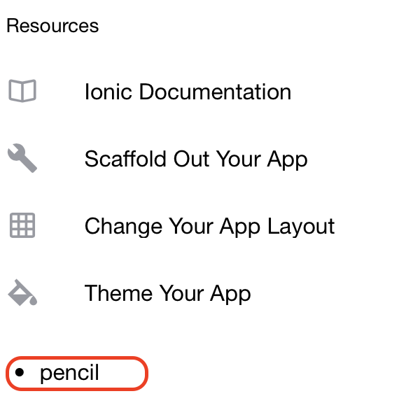

# Testing - Connecting the Dots

## 1. Viewing Firebase data

* If all goes well, you should see the following:

> Milestone: This is a major one! You can see Firestore data in your Ionic Application.

## 2. Changing Firestore data

* Now, with your Ionic app still running, update the value of *pencil* in Firestore to *eraser*

* If you switch back to your browser, you will see that the page has updated - and without a refresh!

> Milestone: Firestore updates ripple through to Ionic

## 3. Changing Ionic data

* Update src/app/home/home.page.html

* If you switch back to your browser, you will see that the page has updated - and without a refresh!

* This is incredible as it means you don't have to restart your Application if you make any code/data changes

> Milestone: Congratulations! You've come a long way.  Take a bow.

### [Next Step: Deployment](deployment.md)
