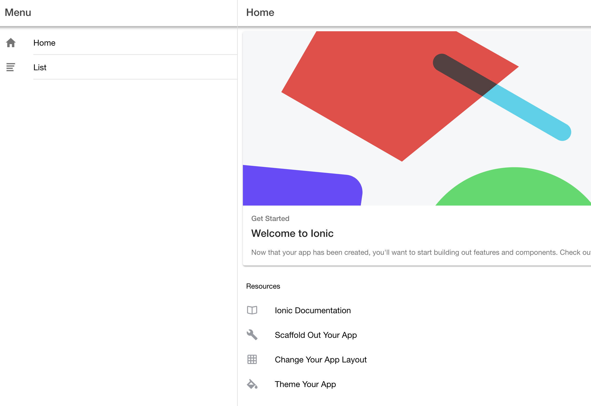
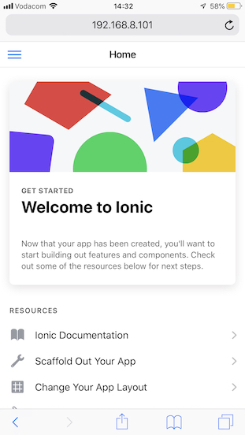
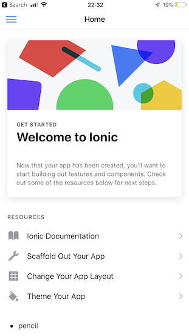

# Ionic Setup and Testing

This section details how to set up Ionic, create a new project and test it.

## Setup

* [Install npm](https://www.npmjs.com/get-npm)
* Install ionic package
```
npm install -g ionic
```
* Create your Ionic project

```
ionic start <project> <format> --type=angular
```
* Example:
```
ionic start myApp sidemenu
ionic start myApp tabs
```
```
ionic start firebase-ionic-simple sidemenu --type=angular
```
* Fire up your ionic project -

```
cd firebase-ionic-simple
ionic serve
```
* Wait until you see -
```
...
[ng] ℹ ｢wdm｣: Compiled successfully.
```

## Testing

One of the most rewarding aspects is to actually *see* something tangible.  Fortunately, with Ionic, you're now at a point where you can actually view something and also get a feel for the App you're trying to build.

### Browser
* As part of the Ionic start, a browser window should have opened - but in case it didn't, navigate to the following URL:
```
http://localhost:8100
```



### Machine/Device on your local network
* If you want to see how it renders from another machine or your mobile device, make sure that device and the computer where you started Ionic is on the same network.  Find the IP address of that machine (x.x.x.x) and navigate to:
```
http://<x.x.x.x>:8100
```



### Ionic Devapp
* You can also use the [Ionic DevApp](https://ionicframework.com/docs/appflow/devapp/) to test your application on your mobile device.
* As you will notice from the image below, there is no browser address bar.  This is how you "App" will render or present itself on a mobile device.



> Milestone: Ionic App running!

## Get your code into Git
* Get into the practice of checking your code into version control.
* To see a list of files which have changed, run
```
git status
```
* To add files in, run the following:
```
git add .
```
* To commit the files to your "local" version control -
```
git commit -m 'Ionic'
```
* To push the files to your git repo (which we cloned from at the beginning), run:
```
git push
```
> Milestone: Your source code is in version control!

### [Next Step: Firebase Setup](firebase_setup.md)