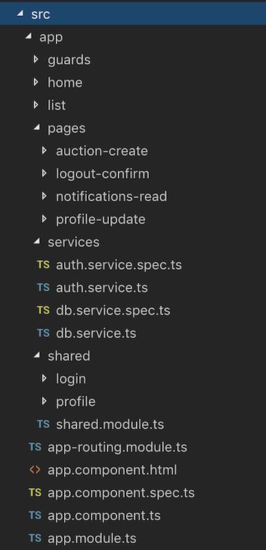

# Ionic Project Structure

## Shared Module
```
ionic generate module shared
```

### In Shared Module
* Import
```
import { IonicModule } from '@ionic/angular';
```

* Components under Shared Module
```
 ionic g component shared/profile --export
 ```

* Create component and export from the command line
```
ionic g c shared/login --export
```

## Pages
* Create folder
```
mkdir src\app\pages
```

* Create new Page
```
ionic g page pages/todo
```

* Generate Component under page (for lazy-loading of component)
```
ionic g c todo/todo-form
```

## Services
* Create folder
```
 mkdir src\app\services
 ```

* Create new Service
```
ionic g service services/db
ionic g service services/auth
```

## Guards
* Create folder
```
mkdir src\app\guards
```

* Create new Guard
```
ionic generate guards guard/AuthGuard
```

---
The diagram below shows a project stucture with:
- Shared Modules
- Pages
- Components
- Services
- Guards




