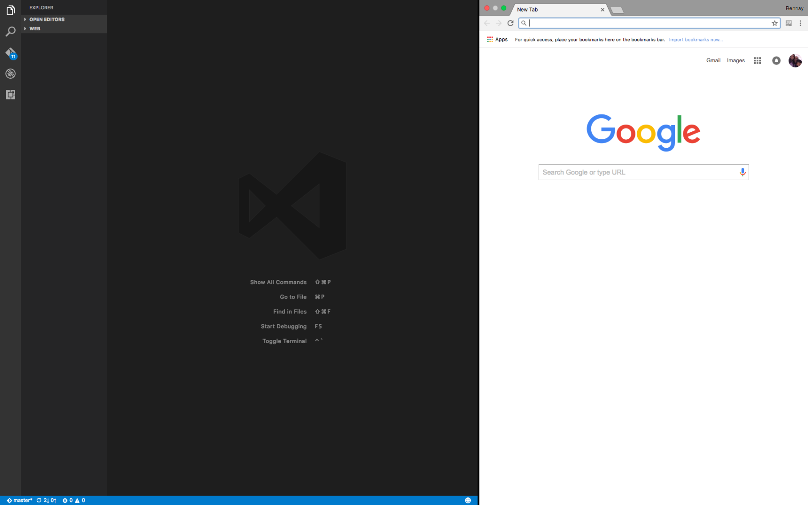
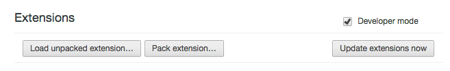
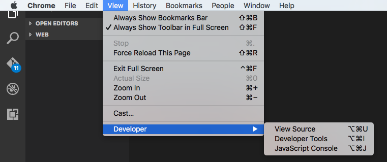
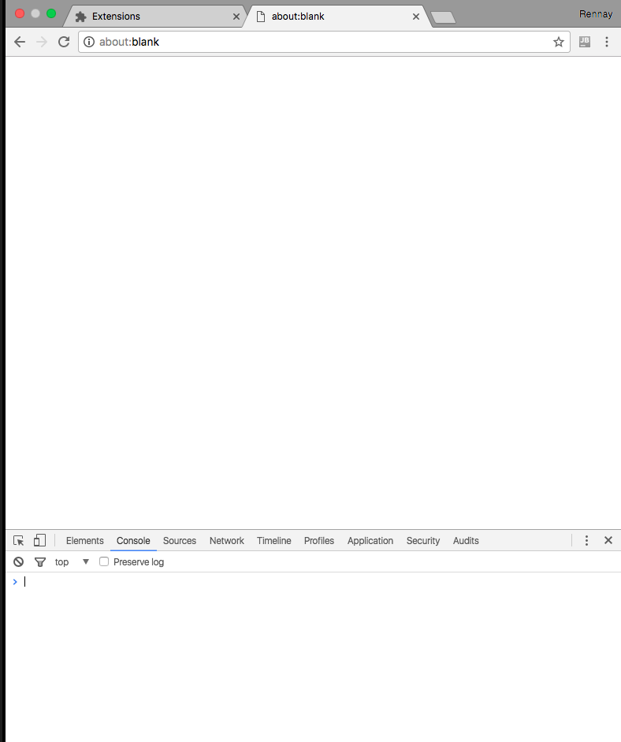
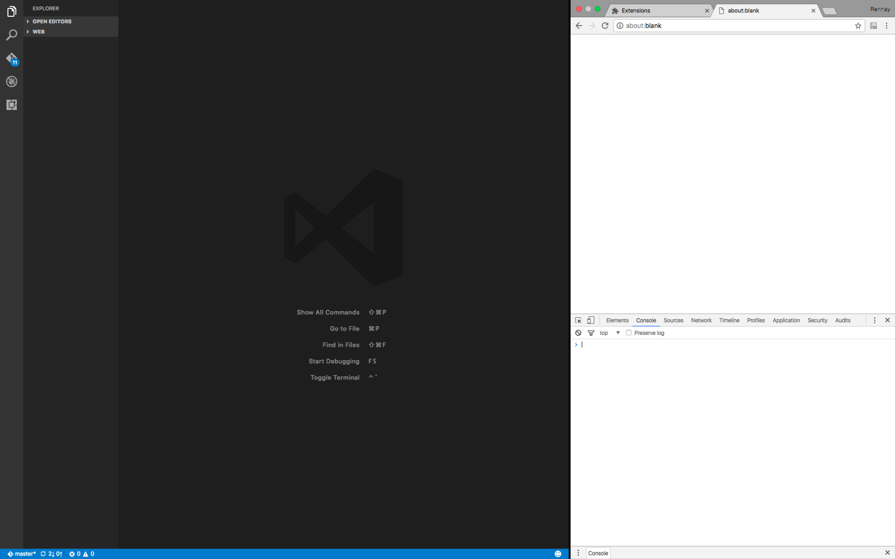
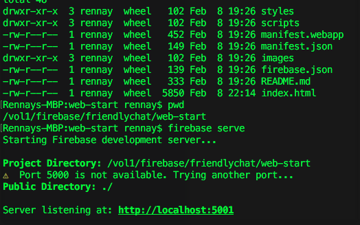
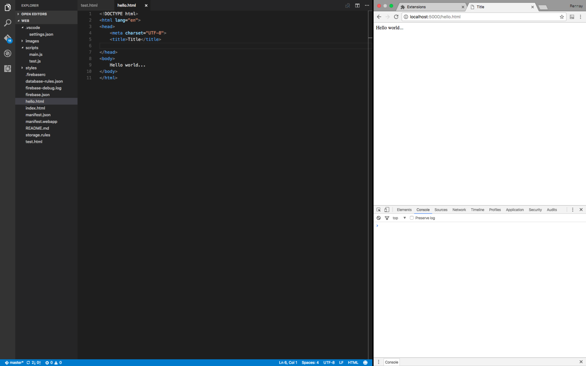
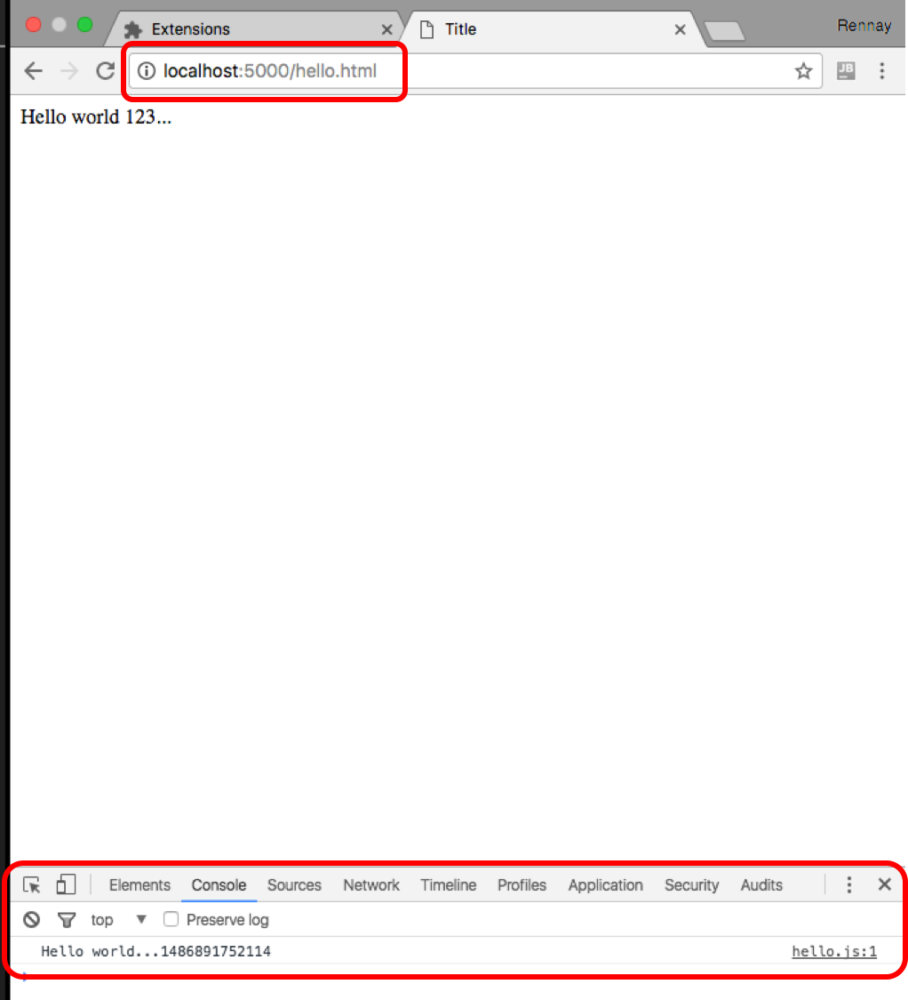

# JavaScript for Java Dinosaurs

## Environment Setup

Ok. You’ve made the mental decision that you’re going to learn JavaScript and from the previous post, you’ve installed Microsoft Visual Studio Code.  So, how do we get a “Hello World” up and running.  One of the benefits of using an IDE like WebStorm is that it provides a “full environment” where you can execute JavaScript.  Having a single IDE also allows you to debug (like breakpoints, variable inspection) in a single environment.  Now, before you disgustedly turn away thinking that I’ve reverted my IDE decision from Code back to WebStorm, read on…

All the “young (and cool)” Google Developer advocates (like David East and Matt Gaunt), at least from the YouTube videos I’ve watched, seem to use a simple/basic editor like Atom/Code and Google Chrome (yep – the web browser).  Now, as an “Enterprise Developer”, this makes me a little uneasy as I’ve always associated the “web browser” to the realm of the “web developer”.  However, a number of the tools and approaches seem geared toward this type of environment, so I figure my approach is: “adapt-or-stay-a-dinosaur”.  As the only dinosaurs I’ve seen are on TV (or in a museum), I reckon that if I stay a dinosaur and only know Java, I’m going to be looked at in a few years from now as I look at “Cobol” developers…

### Lesson #1: Split-Screen Mode

So, with that philosophical soliloquy out of the way, the next step is quite important.  You need to configure your Operating System for “Split Screen” mode.  This is the [reference](http://www.laptopmag.com/articles/use-os-x-el-capitans-new-split-screen-mode) I used for “Mac”.  So, to be cool like David and Matt, this is what your environment is going to be like…  If you’re following, you have Microsoft (yes I’ve said it again) Visual Studio Code and Google (hoping it balances Microsoft) Chrome side by side.  I’m so sorry James Gosling – I realise that I’m a massive disappointment at this time – but I have to evolve… 😦

### Lesson #2 Google Chrome Developer Mode

The next step is to enable Developer mode in Google Chrome.  The last “Developer” extension I heard about in Chrome was “Firebug” for FireFox and although I dabbled and was quite impressed, I never really pursued it.  I am probably mistaken but the tools/capability provided by Firebug are probably equivalent to those tools provided by Google in Chrome.  Navigate to Chrome settings (on Mac, Preferences -> Extensions) and tick the little “Developer mode” checkbox at the top of the Extensions page…

navigate the View menu, you will see a “Developer” option like below:

If you select any of these options, you’ll magically see the Chrome browser window split into the following:

Click through some of the tabs – its actually quite impressive…  Hats off to Google for providing such cool functionality – out of the box.  Again – I might be a total noob and Safari, Firefox and Internet Explorer might have similar functionality.  So, now your environment probably looks like this:

- On the left, Text Editor (Microsoft Visual Studio Code),
- On the right, Browser (Google Chrome) split into:
browser window (top) developer console (bottom)

If you have to resize the browser window to give more space to Visual Studio, don’t feel bad – you need more real estate for writing code.  Its not that you’re favouring Microsoft over Google… 🙂

### Lesson #3: HTTP Server

Wait! Before you go and download Apache Tomcat, GlassFish or WebLogic, read this next section.  As a Java dinosaur, this is your “go-to” for serving up HTTP content.  However, there’s new ways to get going.  Although you can use Node, for this blog, I’m going to use Google Firebase.  This is a great resource – [Firebase Web Codelab](https://codelabs.developers.google.com/codelabs/firebase-web/#1).  If you follow the initial steps, you will install Git – if I recall correctly, once I entered “git” in the Apple environment, it prompted me to install “Apple Developer tools” and automatically set this up…

Download and install – [NodeJS](https://nodejs.org/en/download/).  There are a tonne of posts about NodeJS and I’ll leave that to you to read through for further detail.  Once NodeJS has been installed, you will be able to execute npm from the command line.  Yep – we’re back to Terminal screens and command lines – just like the “good ol’ days”…

Next install “Firebase tools”:

~~~~
npm install -g firebase-tools
~~~~

And start up the firebase server.

~~~~
$ firebase serve
~~~~

I’ve taken a little shortcut.  However, as you will note from the image below, the firebase “server” process needs to be started from a directory that has the necessary configuration files in it.

So, this is your HTTP server process.  No Application Server required and sadly, no java…

**Note:** You can start up firebase to start on a different IP or port with the following:

~~~~
$ firebase serve -p <port> -o <IP>
~~~~

To quickly test this, put a simple “test.html” file in your “root directory” – I’ve used “test.html”.  As you will note from the image below:

- test.html is in the root directory 
- the content of test.html is simply <html>…<head>…<body>
- if it all works, you will be able to load it from the Google Chrome browser with: [http://locahost:5000/test.html](http://locahost:5000/test.html)

### Lesson #4: JavaScript “hello world”

Now, the “html” page is essentially your “container” and you use this as a launch point for your coding environment.  Very simply:

    - web
        - hello.html
            - scripts
                - hello.js

*hello.html*

~~~~
<!DOCTYPE html>
<html lang="en">
<head>
 <meta charset="UTF-8">
 <title>Title</title>
 https://www.gstatic.com/firebasejs/3.6.9/firebase.js
 http://scripts/broker.js
</head>
<body>
 Hello world...
</body>
</html>
~~~~

*hello.js*

~~~~
console.log("Hellod..." + Date.now());
~~~~

If all goes well, you will be able to navigate to [http://locahost:5000/hello.html](http://locahost:5000/hello.html)

If all goes even better, you’ll see an output in the “Console” tab of the Google Chrome developer extension further below!

**Congratulations – you’re now up and running!**

You have now successfully:

- Set up an IDE – Microsoft Visual Studio Code
- Set up your Development Environment – IDE + Browser + Extensions
- Set up your HTTP server to serve up content
- Developed an HTML page which loads a JavaScript file and outputs to the “Console”
