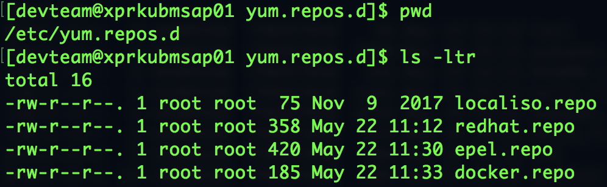
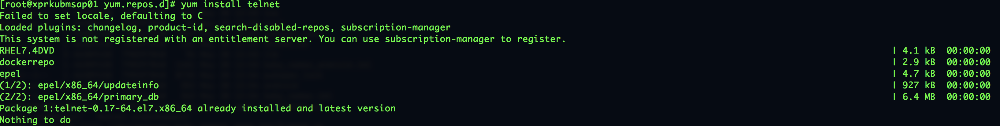
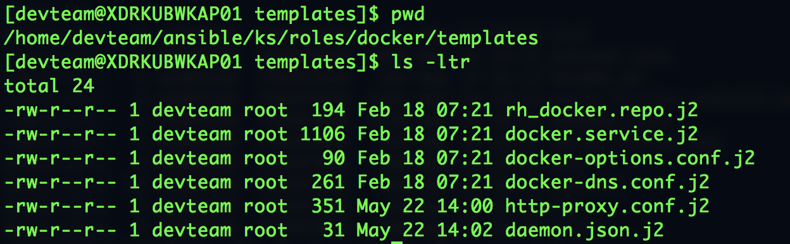
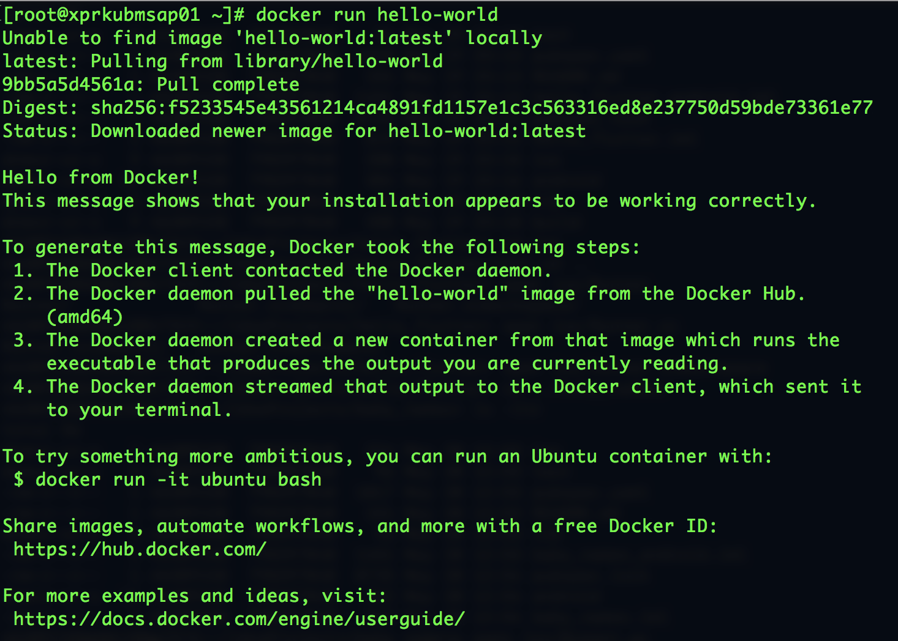
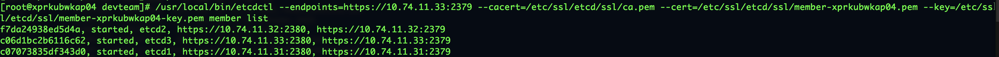

# Installing Kubernetes

So I've recently been getting into Kubernetes and from what I am seeing, I'm blown away with the ease and capbility of the Platform.  Initially, when I overheard "Pods", "Deployments", "Replicas", "Ingress" - I ruled this out to the realm of the "Kubernetes Gods" and didn't pay much attention.  However, with a recent project, I've (fortunately) been able to get more "hands on" exposure.

Some tech guys out there are lucky - they can look at a concept or document and very quickly come up to speed.  Some "Sales guys" are even luckier - they can read a whitepaper (back of a cigarette box) and confidently talk about the concept.  Unfortunately, with me, I build confidence once I "touch-and-feel" and work with something "tangibly".  I need to go through the "Hello World" approach - building something incrementally and understand how the pieces work together.

## Kubernetes-as-a-Service

So, with Kubernetes, I needed to get a "sandbox" in which to work.  The simplest method (these days) is to quickly spin up a Kubernetes Cluster using a Cloud Provider.  Fortunately, Google provide a Developer trial and I was able to spin up a Kubernetes Cluster in a couple of minutes.  Apart from costing a few dollars an hour, I was up and running and deploying a hello-world service using [Google Cloud Kubernetes Quick Start](https://cloud.google.com/kubernetes-engine/docs/quickstart).

Now, in time to come, Kubernetes-as-a-Service will be as prevalent as "Infrastructure-as-a-Service" or like "Electricity".  It will just be "there".  However, for our project at work, we're deploying Kubernetes on-prem.  For the short to medium term, at least in Africa, we're going to be on-prem.  So, with the mission of "learning Kubernetes" to better understand it.

## kubeadm

You can also use [kubeadm](https://kubernetes.io/docs/setup/independent/create-cluster-kubeadm/) to set up an on-premise cluster.  The instructions are fairly straightfoward and it does work well.  However, note that this is a "vanilla" install and does not set up Role-Based-Access-Control (RBAC), certificates and the Dashboard.

## Kubernetes The Hard Way

With Kubernetes on my mind, I sought first to understand.  Found a great introductory course on Udacity [Scalable Microservices with Kubernetes
by  Google](https://www.udacity.com/course/scalable-microservices-with-kubernetes--ud615) with some awesome presenters - Kelsey Hightower and Carter Morgan.  From listening to the Google Cloud Platform podcast, also heard Kelsey's name. One of the most popular repo's on [Kelsey's github](https://github.com/kelseyhightower) is ["Kubernetes The Hard Way"](https://github.com/kelseyhightower/kubernetes-the-hard-way).

Now, this is the *hardcore* way of setting it up.  Its like being dropped in the middle of a jungle with a pack of bubblegum and a sunflower.  To be completely honest, I have not been through it - partly because I'm scared and also because it uses a "Cloud Provider".  Again, this might come down to - starting the task is the hard part, getting through is the easy part.

## Enter Kubespray

I was introduced to Kubespray by a Kubernetes specialist we brought in at work.  Again, "Kubernetes Specialist" means - wears a hooded, dark cloak, murmurs under his breath about SSL certificates and configuration files.  He introduced us to the [kubespray Ansible script](https://github.com/kubernetes-incubator/kubespray).  Having done this before, he had existing configuration files that he customized for our enviornment.  Again - sort of like how my wife makes cupcakes when she's in a hurry - using pre-mix.  However, with some pointers from the Kubernetes Druid, some dogged determination and a single instance of etcd, we managed to build a Development Kubernetes cluster (1 master, 3 workers).  Again, with some pointers - got the Kubernetes dashboard up.

Having an _actual_ environment to work with was amazing.  Managed to get my head around Kubernetes concepts such as "Pods", "Deployments", "Replicas".  Also got a lot more familiar with the command line.  Just "typing" instead of "clicking" makes me feel that I'm actually doing ~something~.  Even better, understanding the syntax of the commands while a Project Manager looks over your shoulder is priceless!  This also helped us understand and bring in an "Ingress Controller".  We're using the [nginx kubernetes-ingress](https://github.com/nginxinc/kubernetes-ingress) which has an awesome rewrite rule.  I wish our project could have used the paid version - [NGINX Plus Ingress Controller](https://github.com/nginxinc/kubernetes-ingress/tree/master/nginx-plus-controller).  

The [installation instructions](https://github.com/nginxinc/kubernetes-ingress/tree/master/install) are outstanding and the [examples](https://github.com/nginxinc/kubernetes-ingress/tree/master/examples) are stellar.  In fact, I use the "tea-svc" and "coffee-svc" from the [complete example](https://github.com/nginxinc/kubernetes-ingress/tree/master/examples/complete-example) to test my installations from time to time.  The *image: nginxdemos/hello:plain-text* is brilliant.

Although I was starting to get my head around Kubernetes, I felt like how I feel when I use Microsoft Excel.  I'm just using a "portion" of it.  Essentially the "Iceberg Principle"...

## Kubespray - The Second Date

Although we successfully commissioned our Development and Test environments using Kubernetes, from a technical perspective - I still felt like a playground bully who just beat up a skinny kid and took his lunch money - it wasn't a fair fight.  On my to-do list, "Kubernetes "Hard Way" still lingered as an outstanding item and not fully understanding the Ansible script made a little uncomfortable in a "stone-in-the-shoe" kind of way.

So, yesterday, I mustered up the courage and took Kubespray on a second date... I must say, it had its highs and lows and more often than not, my kids did not have an adversary for a game of badminton while I hacked away - but I'm pleased that by 02h00, kubespray and I were on much better terms...  The challenge is that kubespray, like my wife, festers - in other words - the script takes forever to run and then throws out a bunch of errors which I need to fix...

Thanks for bearing with me through the long rant... Here's some tips and tricks:

### Script to run:
~~~~
ansible-playbook -i inventory/****-ete/hosts.ini -u devteam -K -k -b cluster.yml
~~~~~

### Yum

As you will note if you monitor the execution of the Ansible script, it installs a number of packages on your OS.  We are using _yum_.  And to get everything working, I had to set up the correct yum repos.

Commands which you might find useful (you need to be root):
~~~~
yum list installed
yum remove telnet
~~~~

Litmus Test: Don't give up until you can install a package.

### Docker

On all the nodes of the cluster (master and worker), it is important to verify Docker is working.

The cool thing about the kubespray script is that it copies all the files _you_ specify to the nodes of the cluster.  So, if you, like us, need to make changes to your Docker configuration files, you simply edit it in one place and it is deployed everywhere.

For example:
- *daemon.json*: I set the bridge IP here to _10.200.0.1/16_ as the default Docker IP fo 172.17.0.1 messed up our access to the corporate proxy
- *http-proxy.congf*: This is where we specify our proxy server (HTTP and HTTPS) and also the address of the local registry we are using
- *docker-options.conf": This is where I specified the insecure registry

It takes a bit of time and you might have to go through a few iterations of:
~~~~
systemctl restart docker
systemctl status docker
systemctl status docker -l
~~~~

*Note*: it also looks like the Ansible script deploys a _/run/flannel/docker_ on the master node which causes a configuration overlap.  Took me a while to find this - but was the reason why I could not start up Docker on the Master node.

*Note*: Although the Ansible script installs the same version of Docker on each node, if there is an existing version, it will not.  So, be careful to check the correct version of Docker on all nodes.

Just work through it until you can get a *hello-world* running on each participant (Masters and Workers) of the Cluster.

*Litmus Test*:
~~~~
docker run hello-world
~~~~

### etcd

One of the pillars of the Kubernetes installation is etcd.  This is essentially a distributed configuration management tool which will protect itself at all costs!  Super-resilient - which you want in production.  Super-stubborn which you don't want at 00h30 and trying to reinstall.

The etcd configuration file can viewed at:
~~~~
view /etc/etcd.env
~~~~

To "talk" directly to etcd, you can use the following:

- Borrowed from "Kubernetes Hard Way"
~~~~
sudo ETCDCTL_API=3 etcdctl member list \
  --endpoints=https://127.0.0.1:2379 \
  --cacert=/etc/etcd/ca.pem \
  --cert=/etc/etcd/kubernetes.pem \
  --key=/etc/etcd/kubernetes-key.pem
~~~~

- Actual syntax:
~~~~
export ETCDCTL_API=3

/usr/local/bin/etcdctl --endpoints=https://10.74.11.33:2379 --cacert=/etc/ssl/etcd/ssl/ca.pem --cert=/etc/ssl/etcd/ssl/member-xprkubwkap03.pem --key=/etc/ssl/etcd/ssl/member-xprkubwkap03-key.pem member list
~~~~

A trick I've learned to "clean" a broken etcd cluster is to - If etcd gets messed up, get the installation to copy the config and then fail:
- stop etcd
~~~~
systemctl stop etcd.service
~~~~
- clean up configuration:
~~~~
sudo rm -rf /var/lib/etcd/* 
sudo rm -f /etc/systemd/system/etcd* 
~~~~
- reboot! sounds a bit "dramatic" but it is necessary:
~~~~
sudo reboot 0
~~~~

The participants of the etcd cluster need to communicate with each other.  Switch of the Firewall service (on the backend nodes).
~~~~
systemctl stop firewalld.service
~~~~

### Kubernetes

Kubernetes does not like Swap.  Be sure to turn it off:
~~~~
sudo swapoff -a 
~~~~

Once the installation is done, check if you can see all the nodes in the Cluster by running the following on the Master:
~~~~
kubectl get nodes
~~~~

If for some reason, a node does not show up as expected, on the node run:
~~~~
tail -100f /var/log/messages
~~~~

Given the errors and retries, the _/var/log/messages_ file could get quite big and fill up your filesystem.  Be sure to clear it from time to time with a handy:
~~~~
echo > /var/log/messages
~~~~

Also, given that *Kubernetes*, *Docker* and *etcd* are all fighting for your attention and write to _messages_, it can become a little daunting.  

What worked well for me is - take it incrementally:
- Stop Kubernetes
~~~~
systemctl stop kubelet.service
~~~~
- Get Docker working

- Get etcd working

- Then run the Ansible script

_Disclaimer_: Please note that this document is a work in progress and as I get more familiar with the kubespray script, I will update/correct accordingly.