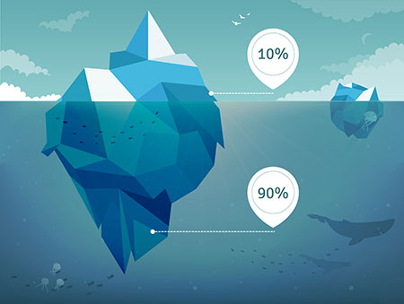

# kubespray

So I've recently been getting into Kubernetes and from what I am seeing, I'm blown away with the ease and capbility of the Platform.  Initially, when I overheard "Pods", "Deployments", "Replicas", "Ingress" - I ruled this out to the realm of the "Kubernetes Gods" and didn't pay much attention.  However, with a recent project, I've (fortunately) been able to get more "hands on" exposure.

Some tech guys out there are lucky - they can look at a concept or document and very quickly come up to speed.  Some "Sales guys" are even luckier - they can read a whitepaper (back of a cigarette box) and confidently talk about the concept.  Unfortunately, with me, I build confidence once I "touch-and-feel" and work with something "tangibly".  I need to go through the "Hello World" approach - building something incrementally and understand how the pieces work together.

## Kubernetes-as-a-Service

So, with Kubernetes, I needed to get a "sandbox" in which to work.  The simplest method (these days) is to quickly spin up a Kubernetes Cluster using a Cloud Provider.  Fortunately, Google provide a Developer trial and I was able to spin up a Kubernetes Cluster in a couple of minutes.  Apart from costing a few dollars an hour, I was up and running and deploying a hello-world service using [Google Cloud Kubernetes Quick Start](https://cloud.google.com/kubernetes-engine/docs/quickstart).

Now, in time to come, Kubernetes-as-a-Service will be as prevalent as "Infrastructure-as-a-Service" or like "Electricity".  It will just be "there".  However, for our project at work, we're deploying Kubernetes on-prem.  For the short to medium term, at least in Africa, we're going to be on-prem.  So, with the mission of "learning Kubernetes" to better understand it.

## Kubernetes The Hard Way

With Kubernetes on my mind, I sought first to understand.  Found a great introductory course on Udacity [Scalable Microservices with Kubernetes
by  Google](https://www.udacity.com/course/scalable-microservices-with-kubernetes--ud615) with some awesome presenters - Kelsey Hightower and Carter Morgan.  From listening to the Google Cloud Platform podcast, also heard Kelsey's name. One of the most popular repo's on [Kelsey's github](https://github.com/kelseyhightower) is ["Kubernetes The Hard Way"](https://github.com/kelseyhightower/kubernetes-the-hard-way).

Now, this is the *hardcore* way of setting it up.  Its like being dropped in the middle of a jungle with a pack of bubblegum and a sunflower.  To be completely honest, I have not been through it - partly because I'm scared and also because it uses a "Cloud Provider".  Again, this might come down to - starting the task is the hard part, getting through is the easy part.

## Enter Kubespray

I was introduced to Kubespray by a Kubernetes specialist we brought in at work.  Again, "Kubernetes Specialist" means - wears a hooded, dark cloak, murmurs under his breath about SSL certificates and configuration files.  However, with some pointers from the Kubernetes Druid, some dogged determination and a single instance of etcd, I managed to build a Kubernetes cluster (1 master, 3 workers).  Again, with some pointers - got the Kubernetes dashboard up.

Having an ~actual~ environment to work with was amazing.  Managed to get my head around Kubernetes concepts such as "Pods", "Deployments", "Replicas".  Also got a lot more familiar with the command line.  Just "typing" instead of "clicking" makes me feel that I'm actually doing ~something~.  Even better, understanding the syntax of the commands while a Project Manager looks over your shoulder is priceless!  This also helped us understand and bring in an "Ingress Controller".  We're using the [nginx kubernetes-ingress](https://github.com/nginxinc/kubernetes-ingress) which has an awesome rewrite rule.  I wish our project could have used the paid version - [NGINX Plus Ingress Controller](https://github.com/nginxinc/kubernetes-ingress/tree/master/nginx-plus-controller).  

The [installation instructions](https://github.com/nginxinc/kubernetes-ingress/tree/master/install) are outstanding and the [examples](https://github.com/nginxinc/kubernetes-ingress/tree/master/examples) are stellar.  In fact, I use the "tea-svc" and "coffee-svc" from the [complete example](https://github.com/nginxinc/kubernetes-ingress/tree/master/examples/complete-example) to test my installations from time to time.  The *image: nginxdemos/hello:plain-text* is brilliant.

Although I was starting to get my head around Kubernetes, I felt like how I feel when I use Microsoft Excel.  I'm just using a "portion" of it.  Essentially the "Iceberg Principle"...

## Kubespray - The Second Date

