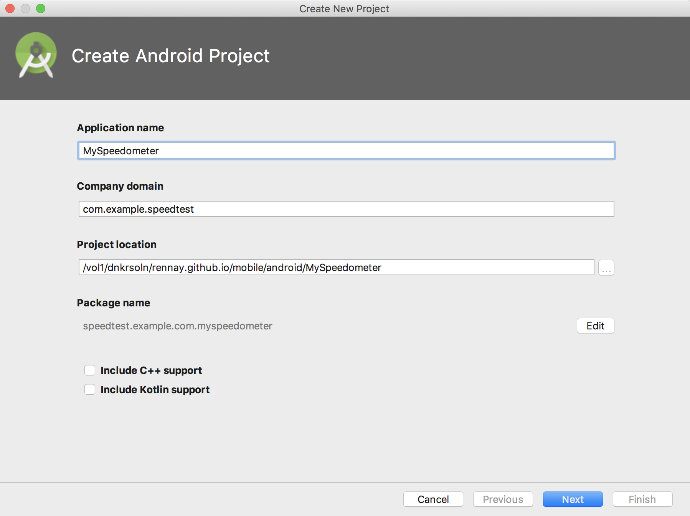
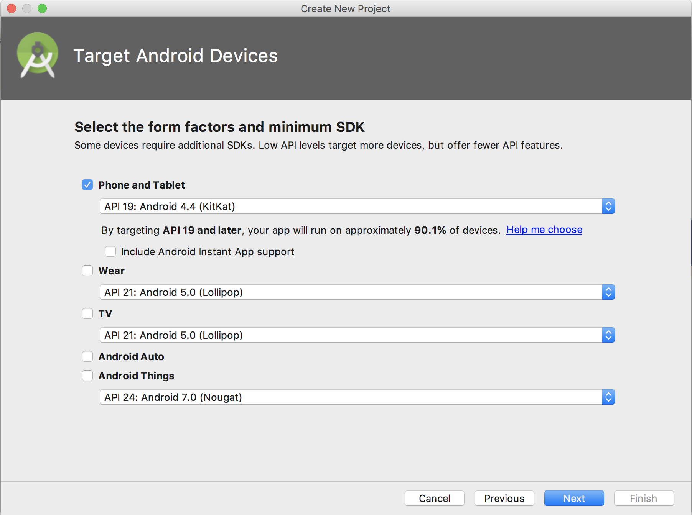
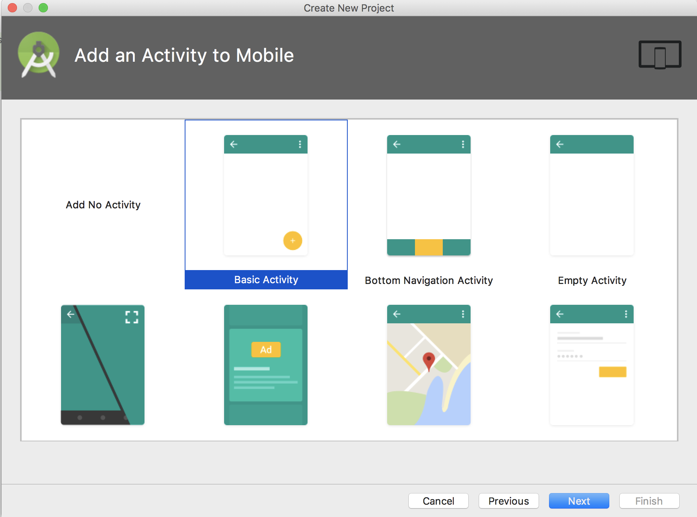
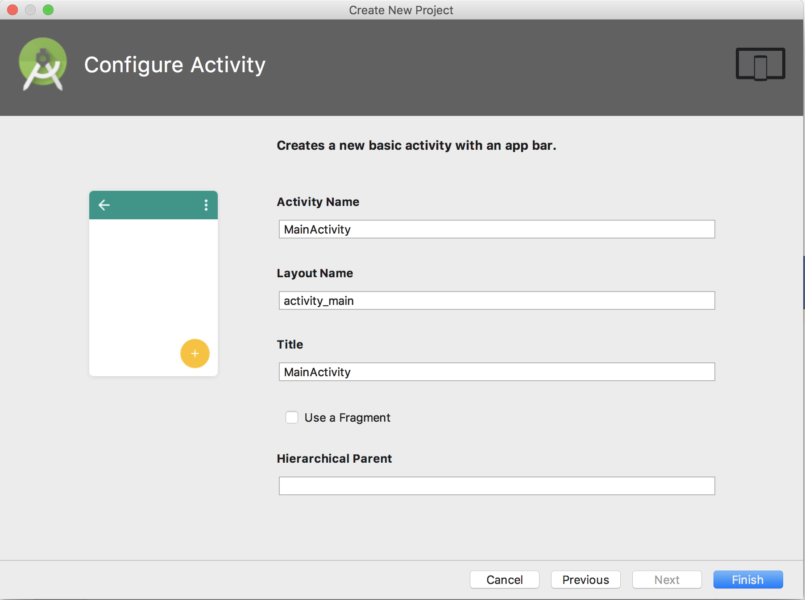
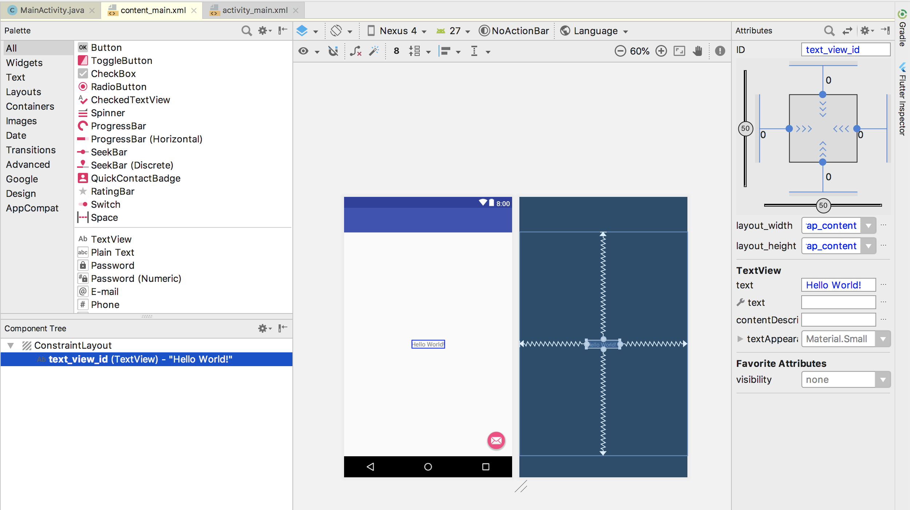
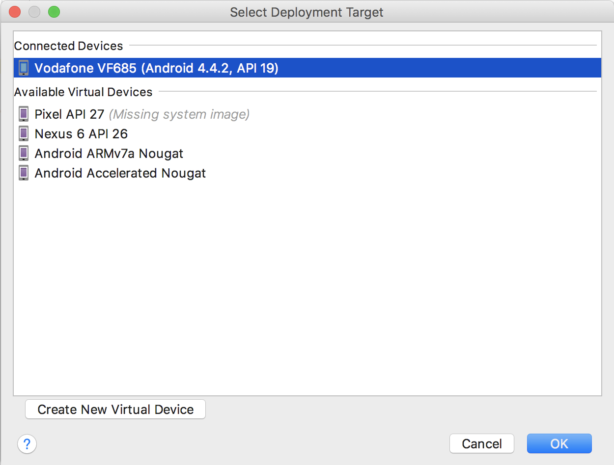
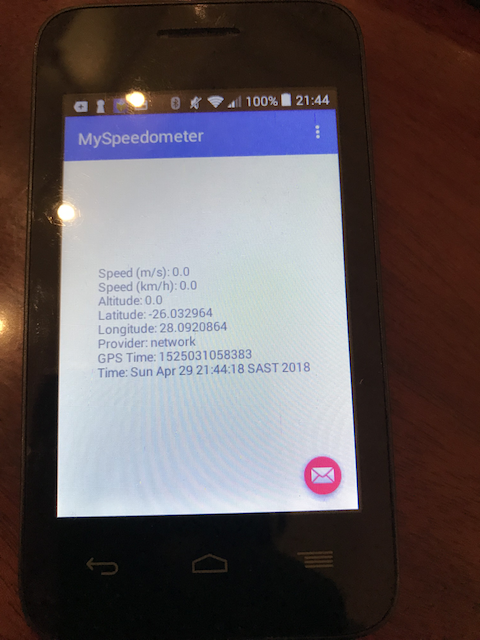

# HOWTO: Create an Android GPS Application

## Step 1: Install and Launch Android Studio

Follow the instructions [here](https://developer.android.com/studio/install).

## Step 2: File - New Project

Create Android Project

## Step 3: Target Android Devices

Select Phone and Tablet.  Choose a relevant API based on the physical Android device you're using.

## Step 4: Add an Activity to Mobile

Choose a *Basic Activity*

## Step 4: Configure Activity

Leave the defautl settings and click Finish

## Step 5: Build the Project

The **Design View** is not available until the project is built.  So, from the *Build Menu*, click **Rebuild Project**

## Step 6: Modify *content_main.xml*

Navigate to *app\res\layout\content_main.xml* and set the ID of the *TextView* component to **text_view_id**.

## Step 7: Modify *AndroidManifest.xml*

The app needs to request permission to access the GPS location.  Add the following lines to *AndroidManifest.xml*

~~~~
<uses-permission android:name="android.permission.ACCESS_COARSE_LOCATION" />
<uses-permission android:name="android.permission.ACCESS_FINE_LOCATION" />
<!-- Needed only if your app targets Android 5.0 (API level 21) or higher. -->
<uses-feature android:name="android.hardware.location.gps" />
~~~~

Refer to [AndroidManifest.xml](app/src/main/AndroidManifest.xml)

## Step 7: Update *MainActivity.java*

Note that not all Android devices are created equal.  Some "lower-end" devices don't have GPS modules and rely on NetworkProvider informationt to get location information.

If you look at the code, you'll see it caters for 2 different *PROVIDERS* - **NETWORK** and **GPS**.

~~~~
if locManager.isProviderEnabledLocationManager.NETWORK_PROVIDER)) {
    locManager.requestLocationUpdates(LocationManager.NETWORK_PROVIDER, 0, 0, li);
}
if (locManager.isProviderEnabled(LocationManager.GPS_PROVIDER)) {
    locManager.requestLocationUpdates(LocationManager.GPS_PROVIDER, 5000, 2, li);
}
~~~~

Refer to [MainActivity.java](app/src/main/java/speedtest/example/com/myspeedometer/MainActivity.java)

## Step 8: Run the Application

## Step 9: Select Deployment Target

You can attach a device to your computer.  If you do, you need to put the device into *Developer Mode*. Google has implemented a real nifty way to do this.  Check out the instructions [here](https://developer.android.com/studio/debug/dev-options).

You could also get away with an emulator for testing.  But nothing beats getting a latitude/longitude from a "real" device.

.

## Step 10: See GPS Information on Device

Unlock the phone.  Once you "Run the App" from Android Developer Studio, it will launch automatically on the device.  

.

