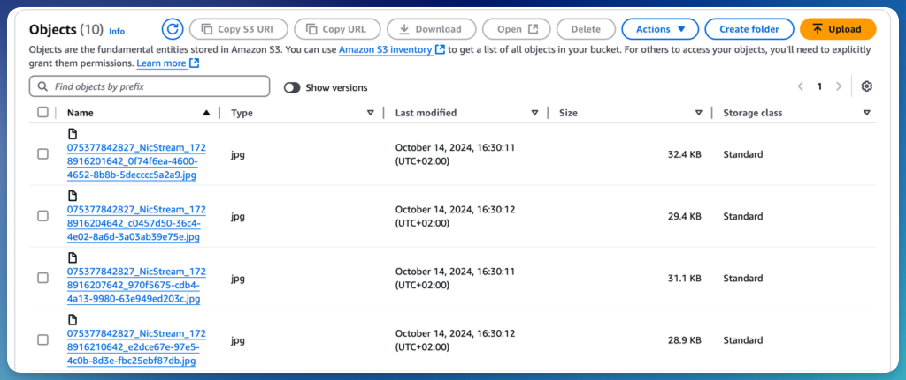
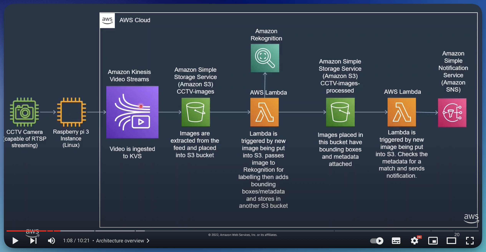

# Project Vision - Rekognition

## IAM

- Policy: *demo-rtc-policy*
```json
{
    "Version": "2012-10-17",
    "Statement": [
        {
            "Sid": "VisualEditor0",
            "Effect": "Allow",
            "Action": "kinesisvideo:*",
            "Resource": "*"
        }
    ]
}
```

- Role: *demo-rtc-role*
```json
{
    "Version": "2012-10-17",
    "Statement": [
        {
            "Effect": "Allow",
            "Principal": {
                "AWS": "arn:aws:iam::075377842827:role/Admin"
            },
            "Action": "sts:AssumeRole"
        }
    ]
}
```

- [Configure IAM](../../aws/iam/role.md)

## KVS

- [Create Stream](../../aws/kvs/create-stream.md)

## Raspberry Pi

### Install KVS

- [Install Amazon Kinesis Video Streams (KVS)](../../hw/raspberrypi/kvs/install.md)

### Test
- [Test stream from Raspberry Pi](../../hw/raspberrypi/kvs/test.md)

## Image Recognition

- [Extract Images from Stram](../../aws/kvs/extract-images.md)

- Confirm image creation in S3



- [Detect Text (CLI, NodeJS, Python)](../../aws/rekognition/detect-text.md)



## References

- [Amazon Kinesis Video Streams Workshop](https://catalog.workshops.aws/kinesis-video-streams/en-US)
- [Kinesis Video Streams (KVS) RTSP Stream Part 2 - Image Extraction to S3 for Rekognition](https://youtu.be/pUvxI76YnfA?si=ybdD2UJqsAf-PzWg) - Paul Shiner