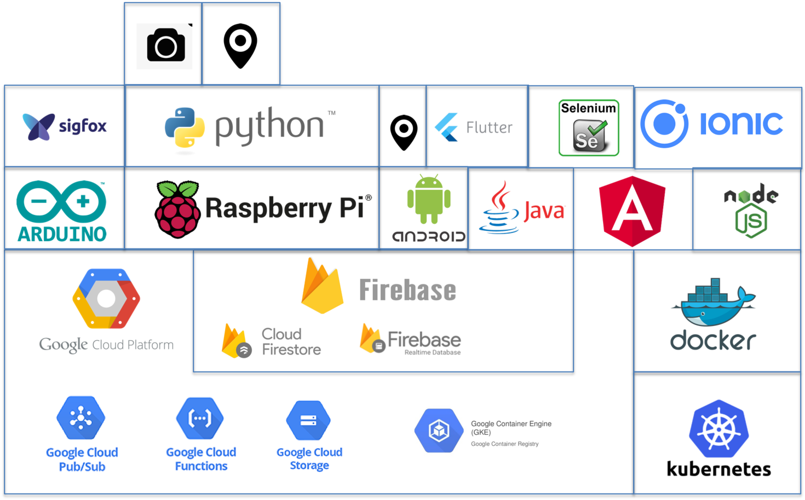

# Rennay Dorasamy, Technologist

Hi there, I'm Rennay Dorasamy!

The intention of this site is (in order of priority):
1. document what I have done over the last few months
2. "bootstrap" *me* in the event that I have to stop a project and return to it after a period of time
3. bootstrap *other users* to get up and running faster

The image below highlights my areas/technologies of interest which are detailed in my posts/articles.

Here are the links to some of my posts:

## Hardware
- [HOWTO: Send a SigFox message using Sqwidnet UnaShield and Arduino UNO](/hw/sigfox)
- [Commissioning a Raspberry Pi](hw/raspberrypi/2018-04-27-raspberrypi-commission.md)
- [HOWTO: Configure a GPS Module with Raspberry Pi](hw/raspberrypi/gps/readme.md)

## Firebase
- [HOWTO: Setup a new Firebase project](firebase/firebase_setup.md)
- [HOWTO: Setup Firestore](firebase/firestore_setup.md)

## Mobile
### Ionic
- [HOWTO: Get an Ionic Application Running](ionic/ionic_setup.md)
- [HOWTO: Configure Ionic to Use Firebase](ionic/angularfire_setup.md)
- [HOWTO: Testing an Ionic-Firebase Application](ionic/ionic_firebase_testing.md)
- [HOWTO: Deploying an Ionic Application to Firebase Hosting](ionic/deployment.md)

### Android
- [HOWTO: Create an Android GPS Application](mobile/android/MySpeedometer)

## Containerization
### Docker
- [Get Docker running on a Corporate VM](docker/2018-04-27-docker.md)

### Kubernetes
- [Installing Kubernetes](2018-05-23-install.md)

## Environment
- [Configure your environment to use a Proxy](/env/2018-04-27-proxy.md)
- [HOWTO: Steps to install Mongo DB](/env/2018-04-27-mongodb-install.md)

## Javascript for Java Dinosaurs
- [IDE Selection](/javascript/2018-04-28-ide-selection.md)
- [Environment Setup](/javascript/2018-04-28-env-setup.md)

## Java/Selenium 
- [South African Dam Watch](https://dnkrsoln.co.za/damwatch.html)
- [Item Price Watch](https://dnkrsoln.co.za/itemwatch.html)
