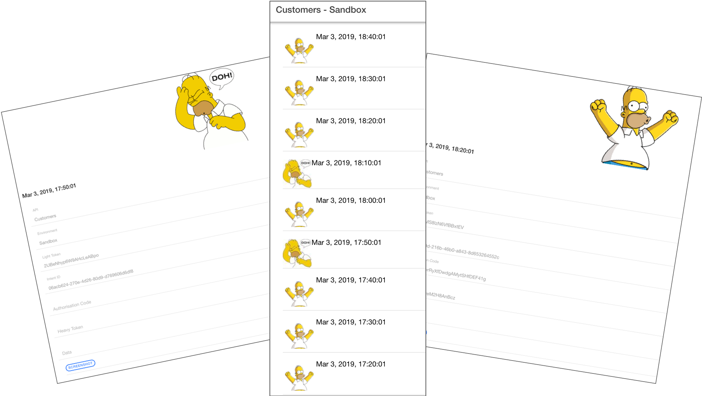
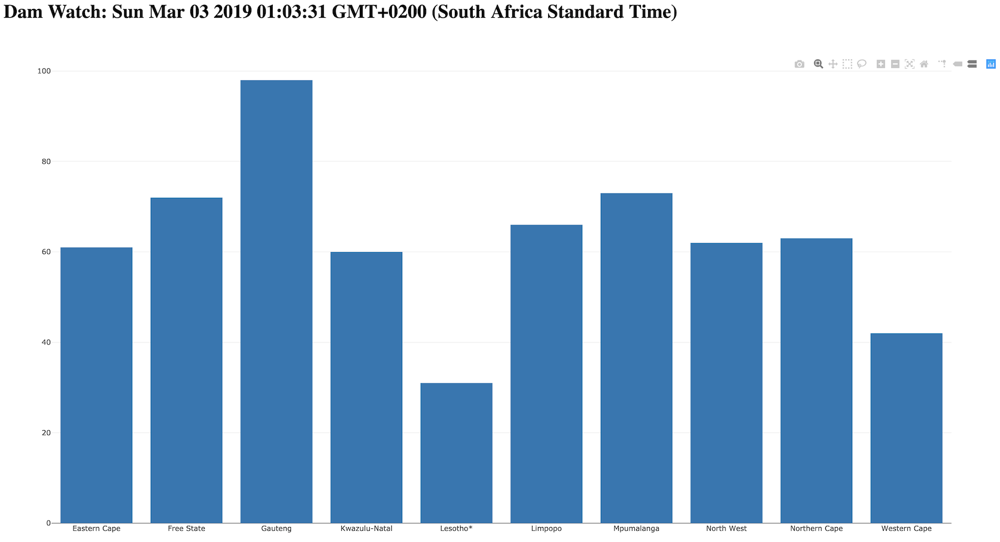

# Rennay Dorasamy, Technologist

Hi there, I'm Rennay Dorasamy!

The intention of this site is (in order of priority):
1. document what I have done over the last few months
2. "bootstrap" *me* in the event that I have to stop a project and return to it after a period of time
3. bootstrap *other users* to get up and running faster

The image below highlights my areas/technologies of interest which are detailed in my posts/articles.

Here are the links to some of my posts:

## Firebase
- [Setup a new Firebase project](firebase/firebase_setup.md)
- [Setup Firestore](firebase/firestore_setup.md)

## Mobile
### Ionic
- [Get an Ionic Application Running](ionic/ionic_setup.md)
- [Ionic Project Structure](ionic/project_structure.md)
- [Configure Ionic to Use Firebase](ionic/angularfire_setup.md)
- [Testing an Ionic-Firebase Application](ionic/ionic_firebase_testing.md)
- [Deploying an Ionic Application to Firebase Hosting](ionic/deployment.md)

### Android
- [HOWTO: Create an Android GPS Application](mobile/android/MySpeedometer)

## Containerization
### Docker
- [Get Docker running on a Corporate VM](docker/2018-04-27-docker.md)

### Kubernetes
- [Installing Kubernetes](2018-05-23-install.md)

## Environment
- [Configure your environment to use a Proxy](/env/2018-04-27-proxy.md)
- [HOWTO: Steps to install Mongo DB](/env/2018-04-27-mongodb-install.md)

## Software Development
### Javascript for Java Dinosaurs
- [IDE Selection](/javascript/2018-04-28-ide-selection.md)
- [Environment Setup](/javascript/2018-04-28-env-setup.md)

### Projects
- [AI Boom Gate](/projects/ai-boom-gate/readme.md)

### Live Applications
#### [Homer Knows](https://homer-ionic-mvp.firebaseapp.com/home)
This application is used to test the availability of an API by:
1. Using a ClientID and Secret to get an Access Token
2. Using the Access Token + Scope to get an Intent ID
3. Using the Intent ID with Puppeteer to authenticate and authorise
4.  Using the return code to get another Access Token
5.  Using the Access Token to make a call against the backend

#### [South African Dam Watch](https://dnkrsoln.co.za/damwatch.html)
As the Western Cape experienced a water shortage in 2018, I was curious to know if this was getting better or worse and also to track other provinces in South Africa.  After some research, I found the [Department of Water Affairs](http://www.dwa.gov.za/Hydrology/Weekly/SumProvince.aspx) site which provided this summary.

However, the "trouble" with this site was:
1.  It did not provide a "historical" view
2.  Sometimes it was not available (possibly due to maintenance)

So, I first wrote a Selenium Application in Java which scraped the site.  I was going through a "Containerization" phase at the time - so the next step was to run the Java Application in Docker.  This was quite a feat as I had to run the Docker container with priviledged access.

Next step was to run this Docker image in a "Cloud" context - so I deployed it to Google Container Registry.  Google is super cool - I think I'm still on the free tier.

Then wired up the Java application to write to Firebase.

Quick HTML or front-end application from there to render the information from Firebase and Voila!

* Current Dam Levels

## Hardware
- [HOWTO: Send a SigFox message using Sqwidnet UnaShield and Arduino UNO](/hw/sigfox)
- [HOWTO: Commissioning a Raspberry Pi (Buster)](hw/raspberrypi/setup)
- [HOWTO: Configure Amazon Kinesis Video Streams (KVS)](kvs)
- [HOWTO: Configure a GPS Module with Raspberry Pi](hw/raspberrypi/gps/readme.md)

